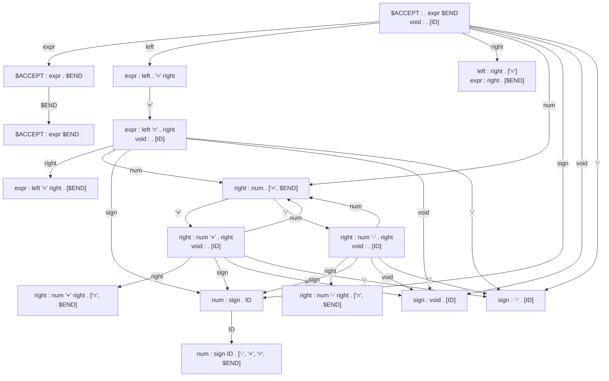

## はじめに

Yaccの文法ファイルからどのように構文解析器を作成するかの内部仕様を説明する。

[Yacc/Wikipedia](https://ja.wikipedia.org/wiki/Yacc)

### 構文規則の前提

パーサジェネレータの説明に当たり、各章の説明では構文規則に次の前提を設ける。

* 原則構文規則のみを記述する
* 英大文字の構文規則は終端記号とする (例: `IF`、`NUM`)
* 英子文字の構文規則は非終端記号とする (例: `if`、`num`)
* 非終端記号の構文規則の記載がない場合は同名の終端記号が設定されているものとする (例: `if : IF`)

### 構文規則の読み方

構文規則の間に`.`が入れば、そこを現在の位置とする。
記号を読み進めると`.`の位置が右に移動し、末尾まで到達すると還元する。
規則が並んでいる場合は複数の候補がある事を示す。

```
start : . FIRST SECOND THIRD
start : . OTHER

↓ FIRSTを読み込み後

start : FIRST . SECOND THIRD

↓ SECONDを読み込み後

start : FIRST SECOND . THIRD

↓ THIRDを読み込み後

start : FIRST SECOND THIRD .
```

還元する行の末尾に`[記号1, 記号2, ...]`とあるのは先読み記号である。
次の記号が先読み記号に合致する場合のみ還元される。

```
if : IF cond THEN expr . [$END]
if : IF cond THEN expr . ELSE expr
```

### 最終目標

次のような構文規則に対しノード図、および構文解析器を作成するのが目標である。

```
expr    : left '=' right
        | right
left    : right
right   : num
        | num '+' right
        | num '-' right
num     : sign ID
sign    : void
        | '-'
void    :
```


