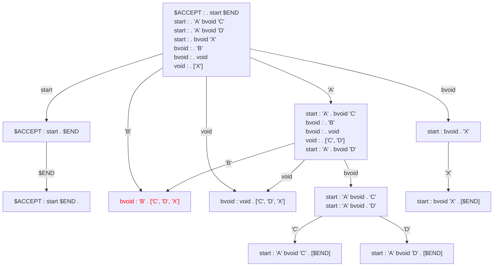

## look-a-headの作成

還元のタイミングで先読みを行いシフトか還元かを求める必要がある。
還元する規則の[followable集合](19.followable集合の作成.md)を先読み規則とする。

### 余談: GNU/bisonの場合

次のような構文規則で `call: VAR '(' . args ')'` の時に `';'` という誤った先読み記号を読み取るとエラーになるが、
GNU/bisonで作成した構文解析器で実行すると、`$default reduce using rule 8 (void)` とある通りエラーになる前に `void`、`args` が還元してしまう。
これは `void` が文脈に関係なく還元するためである。
全体としてエラーにはなるので問題になる事はないが、余計な還元をしてしまう事態が起こる。

```
stmt : call ';'
     | void ';'
call : VAR '(' args ')'
args : void
     | argn
argn : VAR
     | argn ',' VAR
void :

---

state 5

    3 call: VAR '(' . args ')'

    VAR  shift, and go to state 9

    $default  reduce using rule 8 (void)

    args  go to state 10
    argn  go to state 11
    void  go to state 12
```

### 空規則以外のフォロー

空規則以外の先読み記号はfollow集合に頼らざるを得ない。
次のような構文規則において `start : 'A' . bvoid 'C' | 'A' . bvoid 'D'` から `'B'` を読み込み `bvoid : 'B' .` となった際の先読み記号はfollow集合そのままの `['C', 'D', 'X']` となってしまう。
最初に `'A'` を読み込んだ時点で `'X'` の先読み記号は存在しないのは明白であるにもかかわらず、`bvoid : 'B' . ['C', 'D', 'X']` としてしまうのである。

```
start : 'A' bvoid 'C'
      | 'A' bvoid 'D'
      | bvoid 'X'
bvoid : 'B'
      | void
void  :
```

原因はノードの作りが `start : 'A' . bvoid 'C' | 'A' . bvoid 'D'` から来たbvoidなのか、`start : . bvoid 'X'` から来たbvoidなのか区別していないため、ありえない先読み記号で還元を起こしてしまうのである。
ノード図を見ても `'B'` の遷移先がまとめられてしまっていることが分かる。
状態毎にノードを増やしたり、実行時のスタックを見ることで先読み記号を絞ることができなくもないが、通常そこまでこだわる必要はないため許容する。


